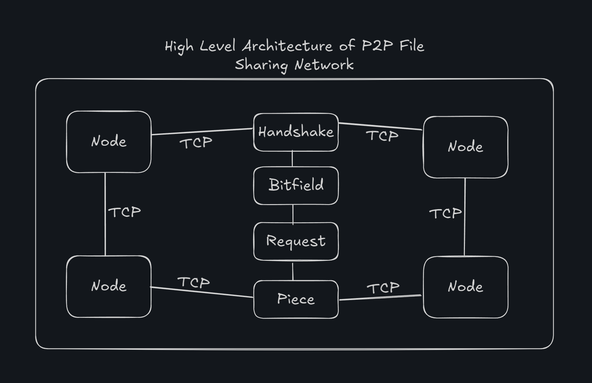

# p2p-file-share


## Introducción

Este proyecto implementa un **sistema para compartir archivos P2P** (peer-to-peer) en consola usando Node.js, inspirado en el protocolo BitTorrent. Permite que múltiples clientes intercambien un archivo directamente entre ellos sin necesidad de un servidor central. Cada nodo actúa tanto como cliente como servidor (igualdad de condiciones), pudiendo **aceptar conexiones entrantes** y **conectarse a pares conocidos**.

El archivo se divide en piezas, que se descargan y comparten entre peers, acelerando la distribución. No depende de trackers ni servidores centralizados: el descubrimiento de peers se realiza mediante *peer exchange*. No incluye cifrado ni autenticación, y soporta cualquier tipo y tamaño de archivo.

---

## Estructura de Carpetas

```
 p2p-file-share/
 ├── src/
 │   ├── manager.js           # Módulo de lectura/escritura de piezas y cálculo de hash
 │   ├── node.js              # Lógica P2P: conexiones, protocolo de mensajes, intercambio de piezas
 │   └── peer.js              # Entrypoint: parseo de args y arranque del nodo
 ├── package.json             # Configuración de npm, scripts de arranque
 └── README.md                # Documentación del proyecto
```

---

## Puntos más importantes

- **Arquitectura P2P pura**: Sin trackers ni servidores centrales.
- **Peer Exchange (PEX)**: Descubrimiento dinámico de peers entre sí.
- **Fragmentación en piezas**: Tamaño de pieza por defecto 64 KiB, flexible para adaptarse al tamaño de archivo.
- **Protocolo de mensajes**:
  - `handshake`: presentación e intercambio de metadatos.
  - `bitfield`: mapa de piezas disponibles.
  - `request` / `piece`: solicitud y envío de datos codificados en base64.
  - `have`: notificación de nuevas piezas obtenidas.
  - `peers`: intercambio de direcciones de otros peers.
- **Seguimiento de progreso**: Porcentaje, bytes descargados y velocidad promedio en consola.
- **Integridad**: Cálculo y verificación de hash SHA-1 del archivo completo.
- **Cross-platform**: Funciona en Linux, Windows y macOS con Node.js v22+.

---

## Arquitectura de Alto Nivel


Este diagrama muestra cómo los nodos se conectan entre sí mediante TCP, intercambian el flujo de mensajes (`handshake`, `bitfield`, `request`, `piece`, `have`, `peers`) y comparten piezas del archivo en una red mallada distribuida.



---

## Funcionamiento del Protocolo P2P

1. **Inicio y Handshake**

   - Cada nodo abre un socket TCP en el puerto especificado.
   - Si se indica un peer inicial (`--peer`), se conecta a él y envía `handshake` con:
     - ID único de peer
     - `fileName`, `fileSize`, `pieceSize`, `fileHash`, `port`
   - Ambos verifican que hablan del mismo archivo (hash o nombre/tamaño).

2. **Bitfield**

   - Tras el handshake, cada peer envía `bitfield` con los índices de piezas que posee.
   - Un seeder envía todas las piezas; un leecher envía un bitfield vacío.

3. **Intercambio de Piezas**

   - El leecher solicita piezas a peers mediante `request`.
   - El seeder responde con `piece` (índice + datos en base64).
   - Al recibir una pieza, el leecher escribe el buffer en el archivo local y marca la pieza como completa.
   - Luego envía `have` a los demás para notificar que ahora posee esa pieza.

4. **Peer Exchange (PEX)**

   - Los peers intercambian listas de direcciones con `peers`.
   - Regla anticolisión: sólo el peer con ID mayor inicia la conexión.

5. **Finalización y Verificación**

   - Cuando un leecher descarga todas las piezas, calcula el hash SHA-1 local y lo compara con el `fileHash` original.
   - Coincidencia: `Verificación de integridad: OK`.
   - No coincidencia: alerta de posible corrupción.
   - El leecher se convierte en seeder y sigue compartiendo.

---

## Instrucciones de Ejecución

**Requisitos**: Node.js v22+.

**Arranque**:

- **Seed** (nodo semilla):
  ```bash
  npm start -- --port 6881 --file "/ruta/al/archivo.ext"
  ```
- **Leecher** (descarga):
  ```bash
  npm run leech -- --port 6882 --file "/ruta/de/salida.ext" --peer 127.0.0.1:6881
  ```

**Parámetros**:

- `--port <puerto>`: puerto TCP para escuchar conexiones.
- `--file <ruta>`: ruta del archivo (seed) o de destino (leecher).
- `--peer <host:puerto>`: (opcional) peer inicial para conectarse.

---

## Ejemplo de Salida por Consola

**Seed (6881)**:

```
Nodo P2P iniciado. ID: ab12cd34ef56 escuchar en puerto 6881.
Archivo disponible: "video.mkv" (150 MB). Esperando conexiones...
Peer 3a1f88b5e2d4 obtuvo la pieza 0.
...
```

**Leecher (6882)**:

```
Conectando con peer inicial 127.0.0.1:6881...
Meta: "video.mkv" (150 MB, 2286 piezas). Iniciando descarga...
Progreso: 10.00% (15 MB/150 MB). Velocidad: 800 KB/s
Pieza 0 recibida. Restan 2285.
...
¡Descarga completada! Verificación de integridad: OK.
```

---

## Posibles Mejoras

- Estrategias de priorización (`rarest-first`, `choking`).
- Mecanismos de timeout y reconexión.
- Cifrado/TLS y autenticación de peers.
- Hashes por pieza para validación granular.
- Optimización para archivos muy grandes.

Este prototipo sirve de base para un cliente P2P estilo BitTorrent sin trackers, implementado completamente en Node.js.

